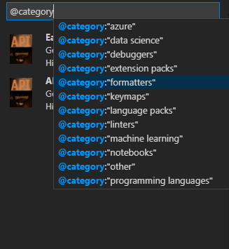
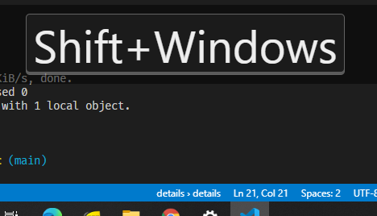
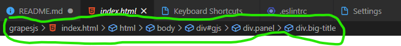
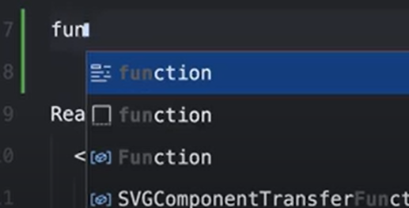
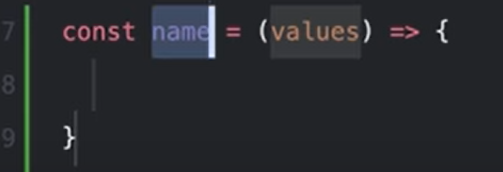
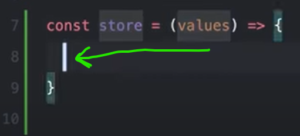

# بسم الله الحي القيوم
# Visual studio Code Summary

  
General Shortcuts and Tricks

  
Tricks

|Trick|How|Additional info|
|:---|:---|:---:|
|Search by Category | 
Adding a snipet of code| `google it hhh bm`|you can add a snipet of code and assign a keyword to it so everytime you write that keyword you get VSC suggesting to complete the rest of code for you
You can rename files and imported modules and it will be updated automatically wherever it was mentioned
ScreenCast Mode| it's good for tutorials and you can turn it on from the command pallete  
`Publish to github`...You can create repos on github without opening the website and push your project live with one press in VS code..|just open the command pallete and look for `Publish to github`
open folder from the Terminal rather from the file menu|`Code folder_name`
----

  
Shortcuts

|Commands|Keyboard Shortcut|additional info
|:--|:--|:--:|
Command palette|`Ctrl+Shift+P` or alternativly `view` > `Command palette`|shows all commands
go to file|`Ctrl + P`
BreadCrumbs|`Ctrl + Shift + .` and `Ctrl + shift+ ;`|
Move between Tabs or "editors" as VS code calls them|`Ctrl + PgUP/PgDn` or <code>alt + &larr;</code>To go Backward and <code>alt + &rarr; </code> To go Forward also you can use `alt + 1` to `alt + 9` if you have 9 tabs open|
Move between split windows or "groups" as VS code calls them|`Ctrl+ alt + 1` to `Ctrl + alt + 9`|
split current tab to the right |<code>Ctrl + alt + &rarr; </code> and to get it back <code>Ctrl+ alt + &larr;</code>
split a duplicate of current tab to the right|`Ctrl + \`
Side bar Toggle|`Ctrl + B`
Terminal Toggle|<code>Ctrl + &grave;</code>

----

----

---------------------------------------------------------------------

  
Editor & Terminal  & Syntax Shorcuts

  
Editor Shorcuts

|Commands|Keyboard Shortcut|additional info
|:--|:--|:--:|
`Ctrl + /` |comment a line or multible linees in any language
`alt + click` |add another cursor anywhere
<code>Ctrl + alt + &uarr;</code> |add another cursor above
<code>Ctrl + alt + &darr;</code> |add another cursor Below
<code>shift + alt + i</code> |add another cursor at the end of lines
<code>alt + &uarr;</code> |**move the line UP or multible lines up**
<code>alt + &darr;</code> |move the line Down or multible lines down
<code>alt + &darr;</code> |**Doublicate a line UP or multible lines up**
<code>alt + &uarr;</code> |Doublicate a line Down or multible lines down
|`tab`|move the cursor in the body of the snippet|

additional info
after VS Code complete your code and write a snippet for you    , you can move the cursor through some positions in the snippet by pressing `tab`   .. keep pressing tab and it will move the curser to another place in the snippet identified in the snippet json file and you can edit it so every time you press `tab` it move the cusor wherever you like in the snippet

<code>shift + alt + &rarr;</code> |**Expand Selection**|
`Ctrl + D` or <code>shift + alt + &rarr;</code> |**Select the current word that the curser is on**|
<code>shift + alt + &rarr;</code> Two times |Select the current line that the curser is on|
<code>shift + alt + &rarr;</code>  Three times |Select the current Block of code that the curser is on|
<code>shift + alt + &rarr;</code>  four times |Select from this line till the end of file|
`Ctrl + D` |**Select the next match of current selection**|
`Ctrl + Shift + L`|**Select All matches of current selection**|also selects all matches of Findmatch
hit `Ctrl + Enter` or click the change all button |To change all matches of a findmatch|
 `Escape` |Deselect(Clear selection) and close the Find window | would also work and clear section in the Terminal window
`Ctrl + G` and type 60 or alternativly `Ctrl + P` then `:60` |Go to line 60|
`Ctrl + U` |**Go to Last Cursor Position**|
`PgUp`/`PgDn` |Go 30 Lines Back or next|
`Ctrl + Shift \` |Go To Brackets|
`F12` |Go To Defention|
`Ctrl + F12` |Go To implementation|
`Alt + F8` |Go To Next Problem (Error,Warn..etc)|
`F8` |Go To Next Problem in all files(Error,Warn..etc)|
`F4` |Go To Next reference|
`shift + F4` |Go To last reference|
`F7` |Go To Next Sympol Highlight|
`shift + F4` |Go To References|
 <code>alt + &uarr;</code> and <code>alt + &darr;</code> |Scroll up and down like the mouse |
`Ctrl + shift + [`   `Ctrl + shift + ]` |Fold and unfold Code blocks|
`Ctrl + K Ctrl + 0` |Fold All|
`Ctrl + K Ctrl + j` |unFold All|
`Ctrl + K Ctrl + /` |Fold all Comment blocks|
`Ctrl + K Ctrl + 1/2/3..7` |Fold Lvl 1 to 7|
`Shift + alt + F` |Format File|
`Ctrl + K Ctrl + F` |Format Selection|

----

  
Bash Terminal Shortcuts

|Command|Shortcut|Additional info|
|:---|:---|:---:|
Terminal Toggle|<code>Ctrl + &grave;</code>
New Terminal|<code>Ctrl + Shift +&grave;</code>
Kill Active Terminal|`Ctrl + K` <code>Ctrl +&grave;</code>| Needs To be Assigned first as there's no such shortcut by default
To move the Cursor of the mouse| `alt + click`|should be specified from the settings
Copy text|` Ctrl + shift + C` or `Ctrl + insert`
Paste text|`Ctrl + shift + V` or `insert` or `shift + insert`

----

  
HTML ShortCuts

|Shortcut|Command|Additional info|
|:---|:---|:---:|
`! + Enter`| you know it
`d + choose div from th list and hit Enter`| all you need to do is to write the frst one or two letters and Vs code will gnerate the opening and closing tags for you
`Ctrl + Enter`| Goes to next line
`div#id` **and** hit enter| Emmet
`div.class`| Emmet
`h1>span`| Emmet
`p>span+div`| Emmet
`ul>li*8`| Emmet

----

  
Python ShortCuts

|Shortcut|Command|Additional info|
|:---|:---|:---:|
`shift + Enter`|Run Selection or current line in a terminal|
select all + `Shift + Enter`| Run the document or you can assign your own keyword to it as it doesn't come with a keyward I assigned `Ctrl + K Ctr+ Enter` For it
`#%%`|insert `#%%` anywhere to make a code cell that can be run and debuged
`Ctrl + Shift + P` (Command pallete) and search for creting a new `Jupyter notebook`|Jupyter notebook
Select a function and right click then choose extract method or look for it in the command pallete| How to extract a function or a method

----

----

---------------------------------------------------------------------

  
Cool Configs and Extensions

  
Cool Configuerations

|config|additional info|
|:---|:---|
cursor blinking animation|set the cursor blinking animation to expanding instead of blinking from the Settings `Ctrl + ,`
Hide everything in the side bar but the file explorer|in the side bar (`ctrl + B` To Show) in the explorer window(`ctrl + shift+ E` To Show) Hide everything but the file explorer open Editor section and the time line and the outline and everything but your explorer folders
icon theme|don't stick with the default VS icon themes insted download your preferable icon theme and color theme and change to it from `Files` > `preferences` > themes
git bash shell instead of windows cmd|change the default terminal from settings ` Ctrl + ,` to the git bash shell instead of windows cmd or windows power shell
default Cwd (currend directory) to the termianl|set a default path to the termianl to open to instead of writing (cd ./path/some_dir) everytime
the terminal right click behaviour|set the terminal right click behaviour to Default instead of paste
|Delay the function defention pop ups|Delay the pop ups that appears once you hover on or select a function.. you can do that from settings > search for Hover and delay and make it 700ms
Trim Final newlines|When you save a file and last fewlines are just empty and maybe there's random spaces at the end of several lines and you want to getrid of that on saving files.. you can do that from the settings by checking the `Trim Final newlines` and `Trim trailing WhiteSpaces`
Fira Code Font|Replace the Default Font with [Fira Code Font](https://github.com/tonsky/FiraCode) -- To install it go to the settings -- in the font family type in `Fira Code,` at the beggining or type `Fira Code` and delete everything else -- **Tick the check box "Enables/Disables font ligatures" under "Font Ligatures" to enable the special ligatures.** if you can't see this option change it from the json file from null to true just search for the "Font Ligatures"
cascadia code Font|Like the previous but i prefere this over fira tbh
Mouse Wheel Zoom|Tick the check box "Mouse Wheel Zoom" That let you zoom while holding `Ctrl` you can also reset the font zoom by `ctrl + numpad0` but this needs to be assigned as a shortcut as it doesn't come with VS code
End with a newline|Tick the check box "End with a newline" to create a newline at the end of each file

------

  
Cool Extensions

|Extension|additional info|
|:---|:---|
auto rename tag| if you renamed an opening tag and want the closing tag to be renamd automatically there's extensions for that called `auto rename tag`
Polacode extension or Codesnap as an alternative|it produces Code screenshots of a code selection
the Cdnjs extension|insert libraries (google it)
Prettier or Beautify|Beautify has less languages support but it support "Format Selection" so i have both
Bracket Pair Colorizer 2 or Highlight Matching Tag|highleight currnt block from it's name
Log File Highlighter|
**EsLint**| very important formatter for js but you have to do somestuff after installing it google it or read docs (those things are to install globally or locally and create a configuration)
Bookmarks|Mark lines and jump to them
Select By| modify the selection based on Regular Expressions Select By Paste Clipboard: Replace selection with clipboard content Select By Line Number: Place cursor based on line number, uses boolean expression Select By Remove Cursor: Remove one of the multi cursors Move By: move the cursor based on Regular Expressions or a Calculation
Regex Snippets|Easily Insert Popular Regex Codes Without Memorising Anything!
Regex Previewer|Regex matches previewer for JavaScript, TypeScript, PHP and Haxe in Visual Studio Code.
Regexp Explain|explain regex in vscode
npm Intellisense|Visual Studio Code plugin that autocompletes npm modules in import statements
JavaScript (ES6) code snippets|js snippets and move betweeen them with Tabs as we mentioned earlier
Better Comments|Improve your code commenting by annotating with alert, informational, TODOs, and more!
Quokka.js|JavaScript and TypeScript playground in your editor.
Live Server|updates Html previews constantly without having to reload the page
CSS Peek|shows you inline css definitions
Debugger for Chrome| Best debuger for js
import Cost|Display import/require package size in the editor
ES7 React/Redux/GraphQL/React-Native snippets| react snippits
Vetur|Vue formatting and emmets and snippets
Vuln Cost - Security Scanner|Security Scanner to find and fix vulnerabilities in JavaScript and TypeScript.
PHP Intelephense |PHP snippets and formatting
PHP DocBlocker|A simple, dependency free PHP specific DocBlocking package
Cobalt2 Theme Official| is very good for a day time coding along with the default vsc dark theme and night owl and viow and material theme and drakula and tokyo night
Material theme occean high Contrast|for me is the best for a night coding with no competetors or maybe the night owl and also default dark might work
GitLens — Git supercharged|a ton of git features

----

--------------------------------------------------------

  
File and Folder Names Explained

File Name|what about it
:--|:--|
package.json|&oast; the settings file used by npm (node Package manager) to configure or set-up the project  &oast;  It usually comes with a folder named `node_modules` that contains all dependencies  

 and a dependency means
 that when a piece of software relies on another one, a dependecy is that other one..(for eg. the extension "pretier" can be installed either globally for the Vs code or locally to be used in only one project by running the command ` npm install prettier -D --save-exact ` then it will be installed onlly in the project directory inside a `node_modile` folder 
--------------------------------------- 

 But How We Can create a Package.json file?? 
 you can write in the terminal `npm init` this will ask you a series of question or you can type `npm init --y` and it'll create one with the defaults  

.VScode (Folder)|Contatins a "settings.json" file that have configs that VS code will use only for this project

